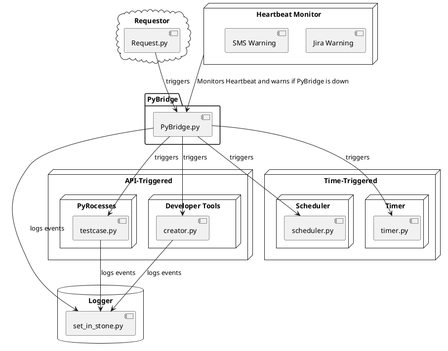

The infrastructure of the application is represented in the following PlantUML diagram:

### In the provided UML diagram, the following components are represented:
* **PyBridge:** is the central hub of the application. It serves as the main entry point for all triggers and manages the execution of various scripts based on these triggers. It also interacts with the logger script to log events and activities.
* **Heartbeat Monitor:** is a separate component that continuously checks if the main application (in this case, **PyBridge.py**) is running. If it's not, it creates a ``Jira ticket`` and sends an ``SMS message``.
* **set_in_stone.py:** is the dedicated logger script. It is invoked by all other scripts in the system to log events, providing a centralized logging mechanism. This ensures that all activities within the application are tracked and recorded for future reference or debugging purposes.
* **request.py:** acts as a requestor that triggers PyBridge.py. It sends requests to the main application, which in turn triggers the execution of specific scripts. This component is crucial for the event-driven nature of the application, initiating actions based on various events or conditions.
* **creator.py:** and testcase.py are representative scripts that can be triggered in different ways. They are categorized under the umbrella of ``API-Triggered`` scripts, meaning they are primarily invoked through API calls. These scripts also interact with **set_in_stone.py** to log their events, ensuring transparency and traceability of their actions.
* **scheduler.py** and **timer.py:** are scripts that fall under the ``Time-Triggered`` umbrella. They are invoked based on ``time-based events``, such as schedules or timers. Like the ``API-Triggered`` scripts, they also log their events to **set_in_stone.py**.

This structure allows for a flexible, event-driven system where scripts can be triggered based on various conditions, and all activities are logged for transparency and traceability. Additionally, the system's health is continuously monitored by the **Heartbeat Monitor**, ensuring prompt action when the system is down.