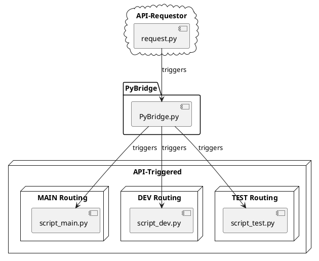

The infrastructure of the application is represented in the following PlantUML diagram:

### Here's a more detailed breakdown of the components:  
* **API-Requestor (request.py):** This module sends requests to the PyBridge, triggering the execution of specific scripts based on the request parameters.  
* **PyBridge (PyBridge.py):** The central hub of the application. It receives requests from the API-Requestor, validates the request tokens, and triggers the appropriate scripts.  
* **API-Triggered Scripts (script_main.py, script_dev.py, script_test.py example scripts):** These scripts are triggered by the PyBridge based on the request parameters. They perform specific tasks.  

Due to a motorcycle crash this project was put on hold, and now many months later I've set my sights on a brighter shores. Onto the next project `(\_(o_o)_`